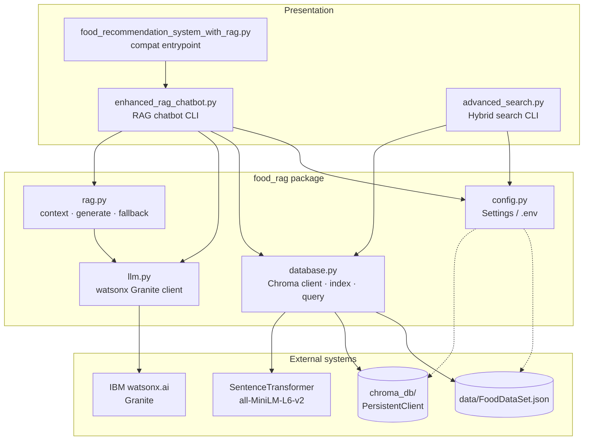
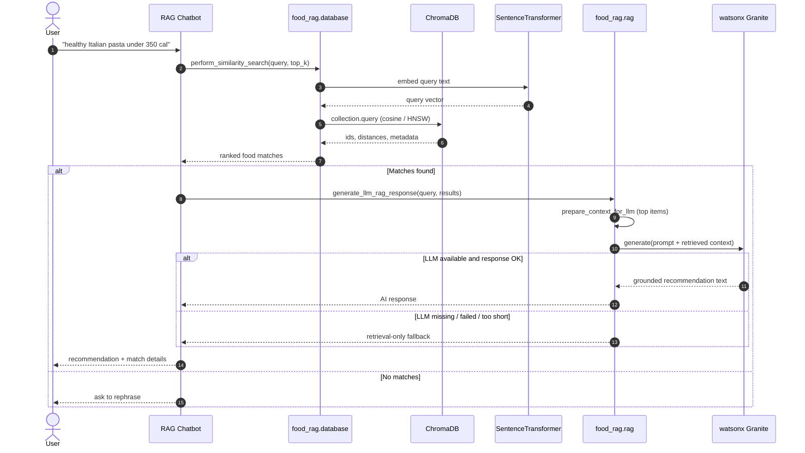
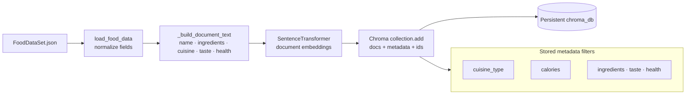
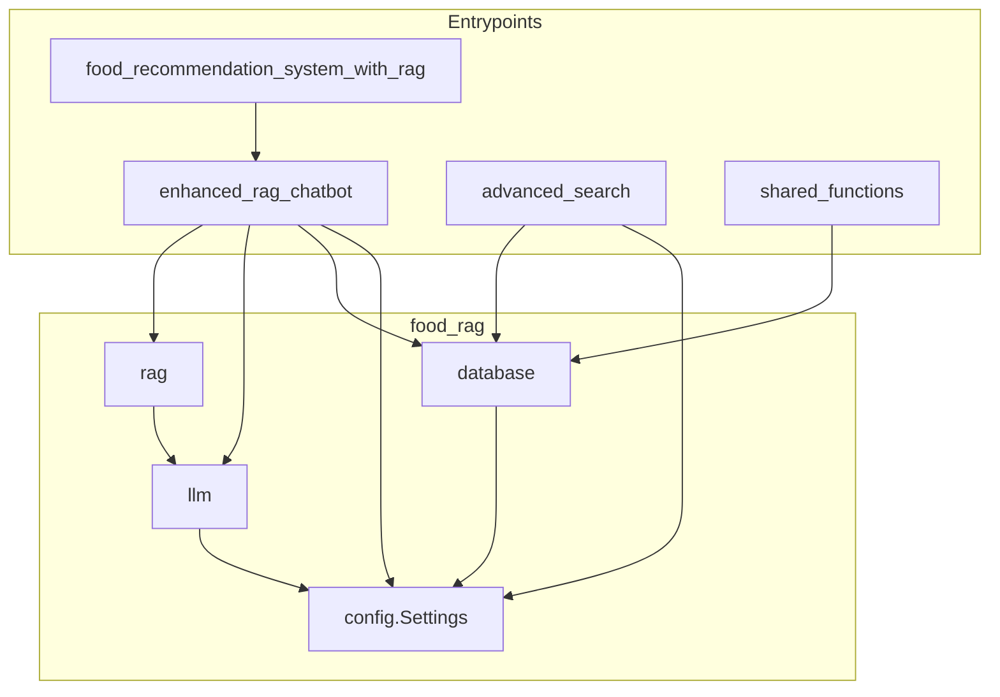

# Food Recommendation System with RAG using ChromaDB

Production-oriented food recommendation stack: **ChromaDB** for persistent semantic retrieval, **sentence-transformers** for embeddings, and **IBM watsonx.ai (Granite)** for grounded generation — with automatic retrieval-only fallback when the LLM is unavailable.

| Layer | Technology |
| --- | --- |
| Vector store | ChromaDB (persistent, cosine / HNSW) |
| Embeddings | `all-MiniLM-L6-v2` (Sentence Transformers) |
| Generator | IBM watsonx.ai · `ibm/granite-4-h-small` |
| Interface | CLI (interactive + one-shot flags) |
| Config | `.env` via `python-dotenv` |

---

## Table of contents

1. [Architecture overview](#architecture-overview)
2. [End-to-end RAG flow](#end-to-end-rag-flow)
3. [Indexing pipeline](#indexing-pipeline)
4. [Module map](#module-map)
5. [Features](#features)
6. [Quick start](#quick-start)
7. [Configuration](#configuration)
8. [Usage](#usage)
9. [Project layout](#project-layout)
10. [Operational notes](#operational-notes)
11. [License](#license)

---

## Architecture overview

The system is split into a thin **CLI presentation layer** and a reusable **`food_rag` core**. The core owns configuration, vector I/O, LLM access, and RAG prompting so both the chatbot and hybrid search CLIs share one retrieval path.



**Design choices**

- **Shared retrieval** — both CLIs call `ensure_collection_ready` + similarity / filtered query helpers.
- **Lazy LLM** — watsonx is initialized on first use; missing SDK or credentials degrade to retrieval-only answers.
- **Persistent index** — collections are reused across runs unless `--rebuild-index` is set.
- **Env-first config** — no hardcoded secrets; `.env.example` documents every knob.

---

## End-to-end RAG flow

How a natural-language preference becomes a recommendation:



**Compare mode** runs the same retrieval twice (two queries), then asks Granite for a side-by-side analysis — or falls back to a simple top-hit comparison.

---

## Indexing pipeline

On first run (or with `--rebuild-index`), the dataset is normalized, embedded, and stored with filterable metadata.



| Step | Behavior |
| --- | --- |
| Normalize | Ensure `food_id`, defaults for missing fields, flatten `food_features` → `taste_profile` |
| Document text | Rich string used only for embedding (not shown raw to the user) |
| Metadata | Filterable fields for hybrid search (`cuisine_type`, `calories`, …) |
| Space | Cosine distance (`hnsw:space=cosine`); similarity ≈ `1 - distance` |
| Reuse | If the collection already has documents, skip re-embedding |

**Hybrid search** combines the same vector query with optional Chroma `where` clauses:

```text
vector similarity  ∩  cuisine_type == X  ∩  calories <= N
```

---

## Module map



| Module | Responsibility |
| --- | --- |
| `food_rag/config.py` | Typed `Settings`, `.env` loading, paths, model IDs, feature flags |
| `food_rag/database.py` | Persistent client, index build/reuse, similarity & filtered search |
| `food_rag/llm.py` | Lazy watsonx client, health check, `generate_text` |
| `food_rag/rag.py` | Context packing, RAG prompts, comparison, fallbacks |
| `shared_functions.py` | Thin re-exports for older import paths |

---

## Features

- **Semantic retrieval** over 185+ food items with cosine / HNSW search
- **Hybrid filters** — cuisine equality and max-calorie constraints
- **Grounded generation** — Granite answers only from retrieved context
- **Graceful degradation** — useful answers even without watsonx credentials
- **Index persistence** — fast restarts; optional full rebuild
- **Dual CLIs** — conversational RAG chatbot and batch/interactive hybrid search
- **12-factor config** — secrets and tunables via environment variables

---

## Quick start

```bash
# 1. Clone and enter the repo
git clone https://github.com/sty0331us/Food-Recommendation-System-with-RAG-using-ChromaDB.git
cd Food-Recommendation-System-with-RAG-using-ChromaDB

# 2. Isolated environment
python3 -m venv .venv
source .venv/bin/activate          # Windows: .venv\Scripts\activate
pip install -r requirements.txt

# 3. Configuration
cp .env.example .env
# Optional: set WATSONX_API_KEY for full AI responses

# 4. Run
python enhanced_rag_chatbot.py
```

**Requirements:** Python **3.10+** (3.11 preferred). First indexing download of the embedding model may take a minute.

For IBM Skills Network labs, `WATSONX_PROJECT_ID=skills-network` often works without a personal API key. Elsewhere, set `WATSONX_API_KEY` in `.env`.

---

## Configuration

Copy `.env.example` → `.env`. Important variables:

| Variable | Default | Purpose |
| --- | --- | --- |
| `FOOD_DATA_PATH` | `data/FoodDataSet.json` | Dataset location |
| `CHROMA_PERSIST_DIR` | `chroma_db` | On-disk vector store |
| `EMBEDDING_MODEL` | `all-MiniLM-L6-v2` | Sentence-transformers model |
| `RAG_COLLECTION_NAME` | `enhanced_rag_food_chatbot` | Chatbot collection |
| `SEARCH_COLLECTION_NAME` | `food_similarity_search` | Hybrid search collection |
| `DEFAULT_TOP_K` | `3` | Default retrieval depth |
| `WATSONX_URL` | `https://us-south.ml.cloud.ibm.com` | watsonx endpoint |
| `WATSONX_PROJECT_ID` | `skills-network` | watsonx project |
| `WATSONX_MODEL_ID` | `ibm/granite-4-h-small` | Generator model |
| `WATSONX_API_KEY` | _(empty)_ | Optional personal key |
| `WATSONX_MAX_NEW_TOKENS` | `400` | Generation budget |
| `ALLOW_LLM_FALLBACK` | `true` | Prefer retrieval-only on LLM failure |
| `SKIP_LLM_HEALTHCHECK` | `false` | Skip startup probe |

`.env`, `.venv/`, and `chroma_db/` are gitignored — never commit secrets or local indexes.

---

## Usage

### Enhanced RAG chatbot

```bash
python enhanced_rag_chatbot.py
python food_recommendation_system_with_rag.py   # same entrypoint

python enhanced_rag_chatbot.py --top-k 5
python enhanced_rag_chatbot.py --rebuild-index
python enhanced_rag_chatbot.py --skip-llm-check
```

| Command | Action |
| --- | --- |
| natural language | Retrieve + generate a recommendation |
| `compare` | AI comparison of two preference queries |
| `help` | In-session help |
| `quit` | Exit |

### Advanced hybrid search

```bash
# Interactive
python advanced_search.py

# One-shot (scriptable)
python advanced_search.py \
  --query "spicy Italian pasta" \
  --cuisine Italian \
  --max-calories 400 \
  --top-k 5

python advanced_search.py --rebuild-index
```

---

## Project layout

```text
.
├── advanced_search.py                 # Hybrid search CLI
├── enhanced_rag_chatbot.py            # RAG chatbot CLI
├── food_recommendation_system_with_rag.py
├── shared_functions.py                # Backward-compatible exports
├── requirements.txt
├── .env.example
├── LICENSE
├── data/
│   └── FoodDataSet.json               # Source catalog (JSON array)
└── food_rag/
    ├── __init__.py
    ├── config.py                      # Settings
    ├── database.py                    # Chroma + embeddings + search
    ├── llm.py                         # watsonx client
    └── rag.py                         # Prompting + fallbacks
```

Runtime artifacts (not in git): `.venv/`, `.env`, `chroma_db/`.

---

## Operational notes

**Production readiness checklist**

- [x] Secrets via environment (not source)
- [x] Persistent vector store with rebuild control
- [x] LLM health check with skip flag for constrained environments
- [x] Deterministic retrieval-only fallback path
- [x] Batched collection population (100 docs / batch)
- [x] Typed settings dataclass for predictable configuration
- [x] Separate collections for chatbot vs search workloads

**When to rebuild the index**

- Dataset (`FoodDataSet.json`) changed
- Embedding model changed (`EMBEDDING_MODEL`)
- Document text / metadata schema changed in `database.py`

**Troubleshooting**

| Symptom | Likely fix |
| --- | --- |
| Empty / weak matches | Rebuild index; try a more specific query |
| LLM warnings at startup | Set `WATSONX_API_KEY` or rely on fallback |
| Slow first launch | Embedding model download + first index build |
| Stale results after data edits | Run with `--rebuild-index` |

---

## License

MIT — see [LICENSE](LICENSE).
